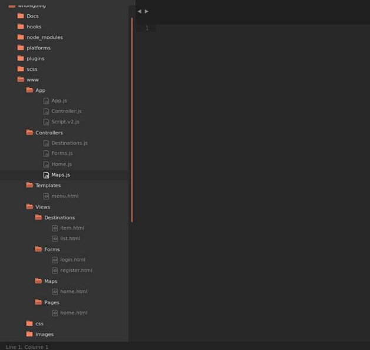
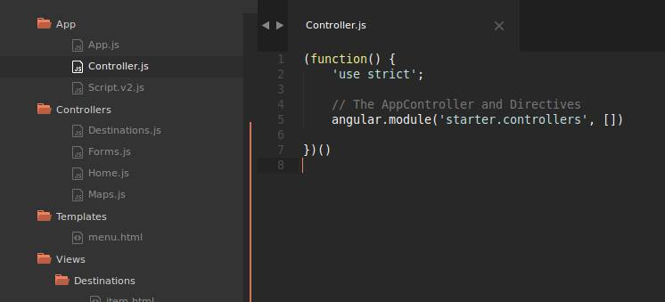
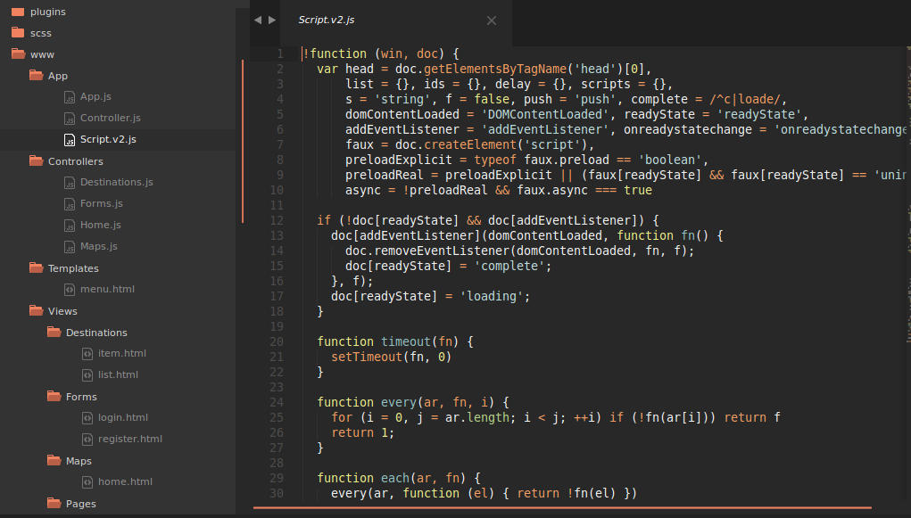
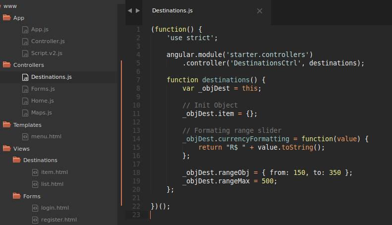

## Ionic app with AngularJs

The Mobile Aplication with Ionic and AngularJs

Author: Francis Rodrigues

#### Screenshots:

- 1 - Structure

- 2 - App.js - Main file in Application

- 3 - Controller.js - Main Controller in Application

- 4 - Script.js - The load AngularJs files

- 5 - Usage Controller

#### References:

[Ionic Framework - Guide](http://ionicframework.com/docs/guide)

[AngularJs - Style guide](https://github.com/johnpapa/angular-styleguide)

[$script.js - Asyncronous JavaScript loader and dependency manager](https://github.com/ded/script.js)

#### License

MIT

